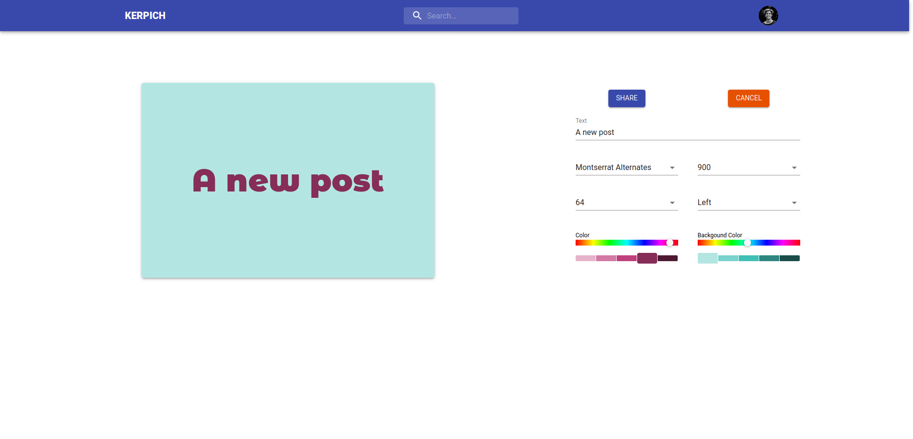
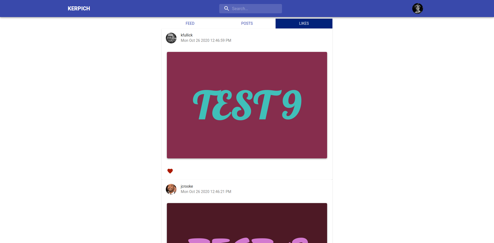

# KERPICH (a MERN stack project)

> A simple social network that allows users to share phrases in a styled way. phrases.

## Table of contents

-   [General info](#general-info)
-   [Screenshots](#screenshots)
-   [Technologies](#technologies)
-   [Setup](#setup)
-   [API](#api)
-   [Features](#features)
-   [Status](#status)
-   [Inspiration](#inspiration)
-   [Contact](#contact)

## General info

Kerpich is a social netwotrk where users create posts by adding and styling phrases. Users an follow each other and like the posts of other users.

## Screenshots




## Technologies

-   Node.js - v14.15.0
-   Express - v4.17.1
-   React - v16.14.0
-   MaterialUI - v4.11.0

## Setup

Create a `.env` file at the root foler and add following values:

```
MONGODB_URI
MONGODB_TEST_URI
JWT_SECRET
PORT
```

User images are randomly generated and taken from [UI Faces](https://uifaces.co/api-key). You can get your API key and add the following value in the `.env` file. If user has a first name ending with `e` or `a` a female image is generated.

```
UI_FACES_API_KEY
```

Once enviroment variables are added, you can install install back-end dependencies by running:

```
yarn
yarn run build
```

To install front-end

```
cd client
yarn
yarn build
```

After initial set up from root folder you can run

```
yarn run start
```

## API

API is documented using [Swagger](https://kerpich.herokuapp.com/api/v1/swagger/).

## Features

-   User authentication with JWT
-   Creating posts by using `Typography` component of `MaterialUI`
-   Users can follow others and can see a posts feed consisting of the posts published by the users they follow.
-   Users can like posts and see the posts liked by themselves or other users

To-do list:

-   Delete post feature
-   Delete user feature
-   Add user image using a cloud image storage

## Status

Project is: _in progress_. New ideas and improvements will be added in time.

## Contact

Created by [@idogrusoz](https://twitter.com/ibrahimdogrusoz?lang=en)
